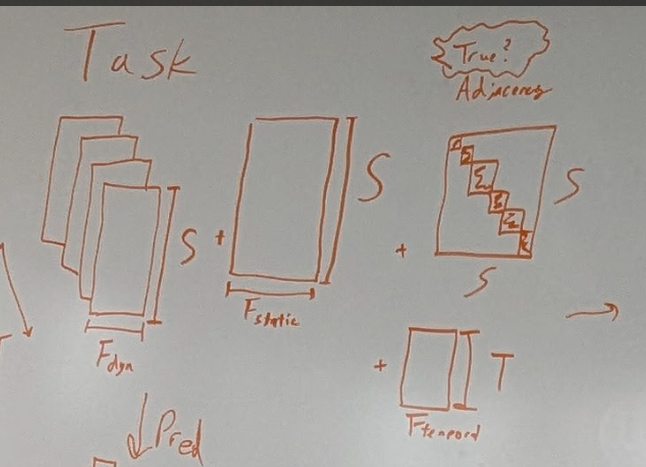

# Plan to refactor code for sharing

## Data

### Goal: Create a spatiotemporal forecasting data class

Constructor/ Attributes:
 - Dynamic features, TxSxF_dyn
 - Static features, SxF_static
 - Temporal features, TxF_temporal
 - Adjacency matrix - are there functions to vary this? or is it fixed?

Methods:
    - to_3D: returns TxSxF tensor
    - to_2D: returns (TxS)xF tensor

Data loaders:
    - Want a function for MA/cook/birds that returns this
    - Arguments should be about spatial/temporal scale and adjacency

Objectives:
- [ ] Create class
- [ ] Write function for MA that returns this class
- [ ] Write function for cook that returns this class
- [ ] Write function for asurv that returns this class
- [ ] Adapt training loop to use this

### Goal: Create a model class

Required methods:
    - log_likelihood
    - Return ranking?

